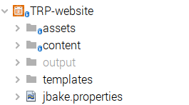
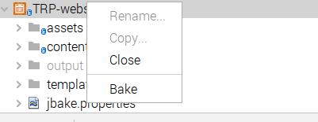
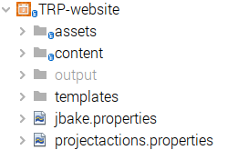
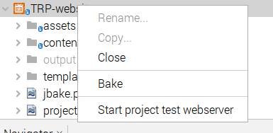
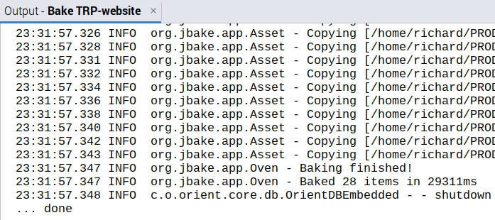

== The JBake Project Type Module

[.smallcaps]#JBake# is a WebSite builder.
By using the IDE for source editing and integrating the
website building actions (external programs) show the benefits of using this
simple Project Type Module

=== Project recognition

[.smallcaps]#A# JBake project is identified by the presence of a
`jbake.properties` file.
This file is always present for any JBake site (as created by the `jbake -i`
command), so any JBake site will immediately be recognised by the project Module
without any user interventions.

=== Project Node Actions

[.smallcaps]#The# JBake Project Type Module adds a single Project Node Action
"Bake", which builds the site (executing the `jbake -b` command).

=== Project Node User Defined Actions

[.smallcaps]#The# module supports user defined actions
for the Project Node, using the content of the  `projectactions.properties`
file.
The most likely initial command to add will run a webserver to allow display of
the site after building.

JBake has a command to  run a web server to allow viewing of the resulting
website, but has the side effect of rebuilding after every incremental change.
As these two actions are not indivisible, some users may not want this rebuild.
Hence this command has not a defined Project Node Action, but a user action can
be defined to handle this requirement in a manner that suits the user.

[.smallcaps]#For# a webserver only option, the user
could select the `JWebServer`  which is shipped with the newer versions of the
Java JDK.

An example defining an additional action which starts jwebserver (to
enable viewing of the generated website).

The resulting project action is added to the project node's menu as
`Start project test webserver`.

[source]
----
1.label = Start project test webserver
1.command = jwebserver
1.commandargs = -d ${NODEPATH}/output/
1.tabname = Test Webserver for TRP-website
1.cleartab = every execution
COMMANDCOUNT = 1
----

[.smallcaps]#While# the JBake implementation of the webserver (and incremental
rebuild), could use:

[source]
----
1.label = Start JBake test webserver
1.command = jbake
1.commandargs = -s
1.tabname = Test Webserver for TRP-website
1.cleartab = every execution
COMMANDCOUNT = 1
----
 

=== JBake IO

[.smallcaps]#The# output and error streams of the jbake command are routed to the 
Output Window tab, while the generated website is created in the `output` folder.

=== Where to find further information

* Source Code is stored in a Git repository on
https://github.com/The-Retired-Programmer/NetBeansNBMs/tree/main/JBakeProject[GitHub]
in a respository containing many NetBeans Modules.

* Further documentation can be found on the
https://www.theretiredprogrammer.uk/tags/JBake.html[TRP website].

=== How to download and install

* Releases of this product are available as Maven Packages from a repository on GitHub
and can be found 
https://github.com/The-Retired-Programmer/NetBeansNBMs/packages/1652862[here].
