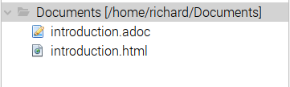
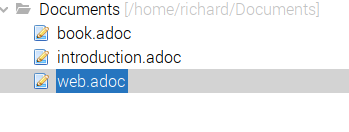
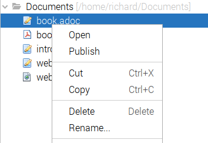
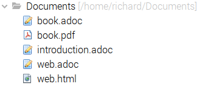
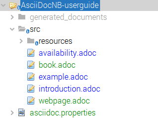
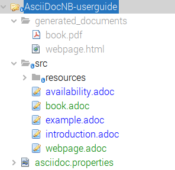

==  AsciiDoctor NB-Plugin by Example

=== AsciiDoc file recognition

Any AsciiDoc file (__.adoc__) will be recognised by NetBeans and will have
a Publish action included in it's popup menu.

image::resources/basicpublishaction.png[basic publish action]

If the file is not located
within a AsciiDoc project then the Publish action will create the published
document in a same folder as the source.

=== Publish a pdf book

To publish an asciidoctor-pdf book your AsciiDoc file will need to define 
options in it's header

[source]
----
:doctype: book
:backend: pdf
:toc: <1>
:revnumber: 2.0.2 <1>
:revremark: Early Preview Edition <1>
:version-label: Release <1>
= AsciiDoc NetBeans Plugin User Guide
 
----
<1> optional options

=== Publish an html article

To publish an asciidoctor article your AsciiDoc file will need to define 
options in it's header

[source]
----
:toc2: <1>
:revnumber: 2.0.2 <1>
:revremark: Early Preview Edition <1>
:version-label: Release <1>
= AsciiDoc NetBeans Plugin User Guide

----
<1> optional options

=== To repurpose an AsciiDoc file for both pdf and html publishing

To repurpose a file to publish in multiple formats, 
create 3 files - the source file (without headers) and two files which contain the necessary
headers and an include statement to add the source.

In __book.adoc__ set the options for a book and an include statement.

[source]
----
:doctype: book
:backend: pdf
:toc:
:revnumber: 2.0.2
:revremark: Early Preview Edition
:version-label: Release
= AsciiDoc NetBeans Plugin User Guide

\include::introduction.adoc[]
 
----

Select Publish on the __book.adoc__ file to create the pdf.

In __web.adoc__ set the options for an html document and an include statement.
Select Publish on the __web.adoc__ file to create the html.

[source]
----
:toc2:
:revnumber: 2.0.2 
:revremark: Early Preview Edition 
:version-label: Release 
= AsciiDoc NetBeans Plugin User Guide

\include::introduction.adoc[]

----

The resulting folder structure which will contain the two published documents:

=== The project structure

The project structure that is recognised by this plug-in is:

* an __asciidoc.properties__ file (content is optional).
* asciidoc files, located within the src folder
* resources (images etc) to be used in the Publishing process

The publishing process will create a __generated_documents__ folder.

There are no specific project level Actions.
  
The standard output and error streams are routed to the NetBeans Output Window,
while the published document is created in the __generated_documents__ folder.

=== Using alternative source and generated documents folders

While there are default folders (__src__ and __generated_documents__) it is
possible to change these folders by addition of properties in the
__asciidoc.properties__ file.

[source]
----

    source_root_folder: sources <1>
    generated_root_folder: books_and_pages <2>

----
<1> source root folder - relative to the project root folder
<2> generated documents root folder - relative to the project root folder

=== To assemble multiple AsciiDoc files for pdf and/or html publishing

One of the major use cases for an AsciiDoc project is to be able to
assemble multiple AsciiDoc source files into a book and/or html file.

Using similar techniques seen in previous examples, an AsciiDoc file for each output is created,
defining the options, and now a series of include statements define the
assembly order.

[source]
----
:doctype: book
:backend: pdf
:toc:
:revnumber: 2.0.2
:revremark: Early Preview Edition
:version-label: Release
= AsciiDoc NetBeans Plugin User Guide

\include::introduction.adoc[]

\include::example.adoc[]

\include::availability.adoc[]
 
----

or if you have the source in a subfolder structure.

[source]
----
:doctype: book
:backend: pdf
:toc:
:revnumber: 2.0.2
:revremark: Early Preview Edition
:version-label: Release
= AsciiDoc NetBeans Plugin User Guide

:imagesdir: part1/
\include::part1/introduction.adoc[]

\include::part1/example.adoc[]

:imagesdir: part2/
\include::part2/availability.adoc[]
 
---- 

and html version

[source]
----
:toc2:
:revnumber: 2.0.2 
:revremark: Early Preview Edition 
:version-label: Release 
= AsciiDoc NetBeans Plugin User Guide

\include::part1/introduction.adoc[]

\include::part1/example.adoc[]

\include::part2/availability.adoc[]

----

=== Save Before Publishing

Save Before Publishing, if enabled, saves any AsciiDoc files which have been
modified but not saved, prior to executing the Publish action.

In non Project Mode this feature is always enabled for the file which the Publish
Action has been applied.

In Project Mode the feature is controlled by a property in the
__asciidoc.properties__ file.

[source]
----

    save_before_publishing: XXX <1>

----
<1> where XXX is one of NO, YES or ALL. 
This property is optional and its default value is ALL.

This property controls how any modified files may be saved prior to running the
publish action.
Only files modified by Netbeans will be considered as a Save candidates.

The possible values for the property are:

* NO - No modified file(s) are saved prior to publishing, so the publish
action will use the version of files as last saved (ignoring the modifications).

* YES - Only the file selected by the publish action (either via the file node
or the editor action), will be saved, if modified, prior to running the
publish action.

* ALL - All modified files that are within the source folder will be saved prior
to running the publish action.
