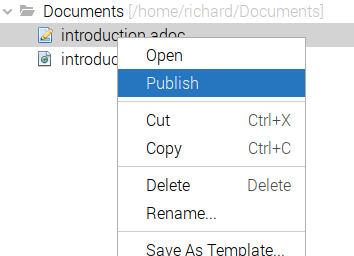
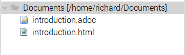
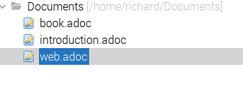
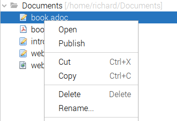
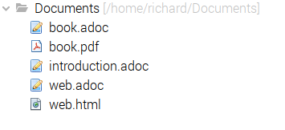

==  Examples of the AsciiDoctor NB-Plugin

=== Basic file recognition

Any AsciiDoc file (__.adoc__) will be recognised by Netbeans and will have
a Publish action included in it's pull down menu.

If the file is not located
within a AsciiDoc project then the Publish action will create the published
document in a same folder as the source.

=== Publish a pdf article

To publish an asciidoctor-pdf article your asciidoc file will need to define 
options in it's header

[source]
----
:doctype: book
:backend: pdf
:toc: <1>
:revnumber: 2.0.2 <1>
:revremark: Early Preview Edition <1>
:version-label: Release <1>
= AsciiDoc NetBeans Plugin User Guide
 
----
<1> optional options

=== Publish an html article

To publish an asciidoctor article your asciidoc file will need to define 
options in it's header

[source]
----
:toc2: <1>
:revnumber: 2.0.2 <1>
:revremark: Early Preview Edition <1>
:version-label: Release <1>
= AsciiDoc NetBeans Plugin User Guide

----
<1> optional options

=== To repurpose an asciidoc file for both pdf and html publishing

To repurpose a file for multiple publishing formats, it can be easily handled
by creating 3 files - the source file (without headers) and two file which contain the necessary
options headers and an include statement to add the actual source.

In __book.adoc__ set the options for a book and use an include to add
the source.

[source]
----
:doctype: book
:backend: pdf
:toc:
:revnumber: 2.0.2
:revremark: Early Preview Edition
:version-label: Release
= AsciiDoc NetBeans Plugin User Guide

\include::introduction.adoc[]
 
----

Select Publish on the __book.adoc__ file to create the pdf.

In __web.adoc__ set the options for an html document and use an include to
add the same source. Select Publish on the __web.adoc__ file to create the html.

[source]
----
:toc2:
:revnumber: 2.0.2 
:revremark: Early Preview Edition 
:version-label: Release 
= AsciiDoc NetBeans Plugin User Guide

\include::introduction.adoc[]

----

The resulting folder structure which will contain the two published documents:

=== The project structure

The project structure that is recognised by this plug-in is:

* an __asciidoc.properties__ file (no content is required).
* asciidoc files, located within the src folder
* resources (images etc) to be used in the Publishing process

image::resources/projectstructure.png[project structure]

The publishing process will create a __generated_documents__ folder.

image::resources/projectstructurewithpublished.png[project structure with published]

There are no specific project level Actions.
  
The standard output of the Publishing command is routed to the NetBeans
Output Window, while the
published document is created in the __generated_documents__ folder. 

=== To assemble multiple asciidoc files for pdf and/or html publishing

As one of the major use cases for an AsciiDoc project is to be able to
assemble multiple AsciiDoc source files into a book and/or html file.

So developing the previous examples, an asciidoc file for each output is created
which define the options and a series of include statements to define the
assembly order.

[source]
----
:doctype: book
:backend: pdf
:toc:
:revnumber: 2.0.2
:revremark: Early Preview Edition
:version-label: Release
= AsciiDoc NetBeans Plugin User Guide

\include::introduction.adoc[]

\include::example.adoc[]

\include::availability.adoc[]
 
----

or if you have the source in a subfolder structure.

[source]
----
:doctype: book
:backend: pdf
:toc:
:revnumber: 2.0.2
:revremark: Early Preview Edition
:version-label: Release
= AsciiDoc NetBeans Plugin User Guide

:imagesdir: part1/
\include::part1/introduction.adoc[]

\include::part1/example.adoc[]

:imagesdir: part2/
\include::part2/availability.adoc[]
 
---- 

and html version

[source]
----
:toc2:
:revnumber: 2.0.2 
:revremark: Early Preview Edition 
:version-label: Release 
= AsciiDoc NetBeans Plugin User Guide

\include::part1/introduction.adoc[]

\include::part1/example.adoc[]

\include::part2/availability.adoc[]

---- 
