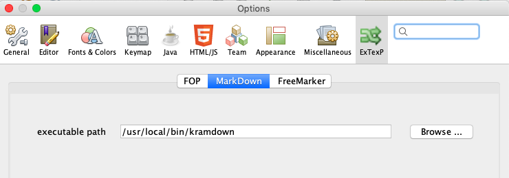

== Installing / Configuring / Extending Extexp
=== Installing

The NBM can be built from source if required.

=== Configuring 

To enable all Extexp functionality, additional software needs to be installed:

*   **Markdown**: it is recommended that the kramdown processor is used to process
markdown. Kramdown can be downloaded from it's https://kramdown.gettalong.org[website].
Just follow the instructions on the install tab. Once installed, Extexp needs to know about
kramdown's location.  By using the NetBeans preferences window and  selecting
the Extexp options panel and then the markdown tab, the path to the kramdown executable
can be defined.
       

*   **FOP**: install the latest version of FOP and then use the same process as was used for
markdown (Extexp options panel/FOP tab) in order to define the location of the executable script for FOP.

*   **FreeMarker**: while FreeMarker software is already installed, it is necessary to define the
root of the users file system where FreeMarker templates are stored. This defaults to a
OS specific value ("/" for MacOS and LINUX, or "c:\" for Windows). If this needs
to be changed for your workstation, it can be configured in the preferences window
(Extexp options panel/FreeMarker tab).
