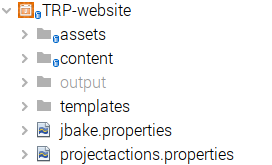

==  Examples of the JBake NB-Plugin

=== The basic project structure

The basic project structure that is recognised by this plug-in is that
generated by __jbake -i__.  However in the case below we also have a GitHub repository
superimposed on that structure (not mandatory).

image::resources/projectstructure.png[basic project structure]

=== The basic project actions

The project includes an action to use __jbake -b__ command to build the site.

image::resources/projectactions.png[basic project actions]

The output of the command is routed to the NetBeans output window, while the
generated website is created in the _output_ folder. 

image::resources/bakeoutput.png[basic project structure]

=== The project structure with projectactions.properties

The projectactions.properties file is used to add further CLI commands to the
project action list.
The projectcations file structue is defined in the ActionsSupport documentation,
but a basic example is show here.  The file defines an additional action to be
added which runs a bash script.

[source]
----
1.label = Copy User Guide (html format)
1.command = bash -c "cd ${PATH} && ./copyuguide ${PATH} ~/UserGuide"
COMMANDCOUNT = 1
----

The bash script is placed in the root folder of the JBake project.

An example of the project structure of a fuller implementation with
3 added actions can be seen below:

=== The project actions with projectactions.properties

The resulting project actions can be seen below:

image::resources/projectactions-with-projectactions.png[basic project actions]
