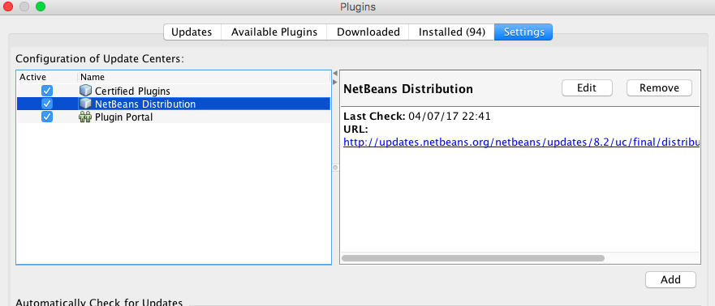
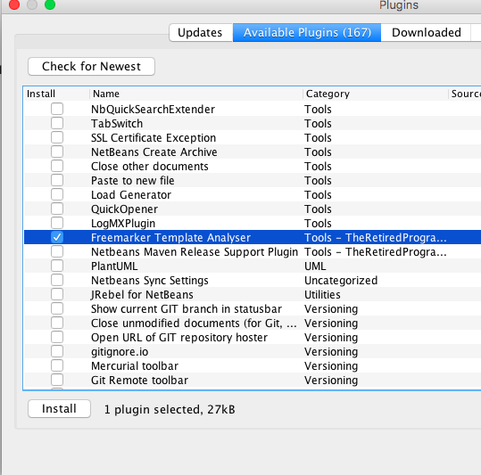
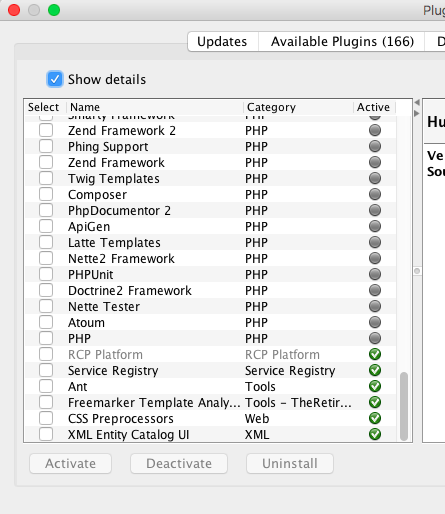

== Installation Notes

**Current release**: v5.0.1

**Minimum Environment**: Netbeans 8.2 and Java 8 
           
The recommended installation process is obtain the Plugin using an additional Update Centre.  This must be
defined in your IDE, but is needed to be done only once as all IDE plugins developed by the The-Retired-Programmer
programme will be distributed via this single Uodate Centre.

To add the Update Centre to the IDE, click on the  Plugins entry in the Tool Menu to display the Plugins Dialog.

image::resources/pluginmenu.png[Plugin Menu]

Select the Setting tab, to display the current list of Update Centres.

Assuming that the additional
Update Centre has not already been defined, press the Add button and enter the two required fields (Name and URL).
Once correctly entered, press OK to complete this operation.

image::resources/addupdatecentre.png[Add Update Centre]

Now select the "Available Plugins" tab.  You should now find a list of all available plugins, including a set of
The-Retired-Programmer plugins.  

If you can't find any entries you could press the "Check for Newest" button to refresh this list, after which the new 
entries should be visible.

Select one or more plugins and then press the Install button.  This will install the plugins into your IDE.

During this process a warning is raised indicating that the plugin(s) are not signed and so may be a risk.
By pressing the Continue putton the installation wil continue.

To confirm this has occurred you can switch to the Installed tab and view the installed plugins.  Note you will have to tick
the box labelled "Show detail" on this tab in order to list all plugins.

Alternatively the plugin can be downloaded directly from Maven Central.  The current release is v5.0.1, which can be downloaded
http://central.maven.org/maven2/uk/theretiredprogrammer/nbpcg/5.0.1/nbpcg-5.0.1.nbm[from Maven Central].

The nbm file can be placed anywhere in the filesystem on your machine, and loaded manually into the IDE using the
Plugin Dialog.

