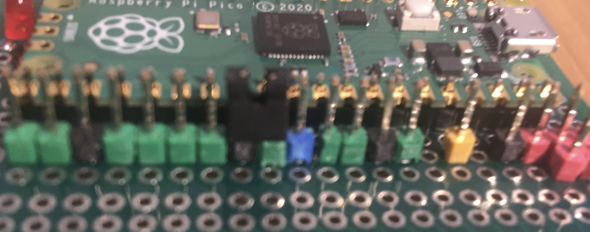

== Running Tests

The compiled tests and associated modules under test must be loaded into the Pico
processor.
Depending on the state of a GPIO pin the tests will be run immediately
the code is loaded, or the testing will be interactive mode and will be run when
requested.

=== Interactive Testing Mode

==== Selecting interactive mode

GPIO pin 22 is used to select interactive mode.
This is done by connecting this pin to 0V.
As this pin is adjacent to a 0V pin, use of a link can easily achieve this.

==== Interactive Mode Commands

[cols="1,1,1,3"]
|===
| Command |Alt Command |Alt Command2 |Description

|; |: | |quit

|# |~ | |run all tests

|? |/ | |list all tests

|space | | |run current test

|> |. |return |run next test

|< |, | |run previous test

|number| | |run specific test

|alpha | | |run specified group tests
|===

==== Example 1 - After load, prompt displayed

[source]
----

TESTING STARTING ...

>

----

==== Example 2 - List All Test (?)

__example is truncated so that it can be easily displayed.__

[source]
----

>?
1 (u) - parse_control_parameters
2 (u) - parse_pinbase
3 (ug) - gpio_event_low
4 (ug) - gpio_event_high
5 (ug) - gpio_event_fall
6 (ug) - gpio_event_rise
7 (ug) - gpio_event_notenabled
8 (ug) - gpio_event_callback
9 (u) - pio_program
10 (q) - square_wave_generator - 6 secs
11 (q) - square_wave_generator - 9 secs
12 (q) - square_wave_generator - 4.5 secs
13 (u) - run length encoder
14 (u) - pio digitalsampling
15 (ud) - dma buffer full
16 (ud) - dma stop quick
17 (ud) - dma stop long
18 (udw) - dma stop window1
19 (udw) - dma stop window2
...
40 (udw) - dma stop window4 three step
41 (udw) - dma stop window4 four step
42 (i) - integration - stop on buffer full
43 (i) - integration - interrupt on buffer full
44 (i) - integration - manual stop - short wait
...
63 (i) - integration - event stop - window 1 - long
64 (i) - integration - event stop - window 2 - long
65 (i) - integration - event stop - window 3 - long
66 (i) - integration - event stop - window 4 - long
>

----

==== Example 3 - Run a single test by entering it's number (digit(s))

[source]
----

>1
RUNNING (1) parse_control_parameters

TEST STATUS: GREEN
Tests: 1; Checks: passed: 12, failed: 0;
>

----

==== Example 4 - Run all tests in a group by entering the group letter (alpha character)

[source]
----

>g
RUNNING (3) gpio_event_low
RUNNING (4) gpio_event_high
RUNNING (5) gpio_event_fall
RUNNING (6) gpio_event_rise
RUNNING (7) gpio_event_notenabled
RUNNING (8) gpio_event_callback

TEST STATUS: GREEN
Tests: 6; Checks: passed: 13, failed: 0;
>

----

==== Example 5 - Run All Test (#)

Example shows parts of the output with a failing test.
All tests are completed.
Test status reported as "RED", with total passed and failed checks.

[source]
----

>#
RUNNING (1) parse_control_parameters
RUNNING (2) parse_pinbase
...
RUNNING (14) pio digitalsampling
    Check buffer read failed - expected 3b7693b2, was 3fedda4e
RUNNING (15) dma buffer full
...
RUNNING (63) integration - event stop - window 1 - long
RUNNING (64) integration - event stop - window 2 - long
RUNNING (65) integration - event stop - window 3 - long
RUNNING (66) integration - event stop - window 4 - long

TEST STATUS: RED
Tests: 66; Checks: passed: 1073, failed: 1;
>

----

==== Example 6 - Exit PTest (;)

[source]
----

>;

 ...TESTING COMPLETED

----

=== Automatic Mode (GPIO pin not connected)

All tests will be run immediately after the code is loaded,
in the order they were added,
and is equivalent to using the # command in Interactive mode.
Reporting of test success/failure will be written to the Pico UART0.
The format of messages will be the same as Interactive Mode.
The test sequence will be run once and then PTest terminates.
The tests can be rerun using the reset button on the Pico (if fitted),
alternatively the tests can be reloaded into the Pico.

==== Example 7 - Automatic Mode Output

__example is truncated so that it can be easily displayed.__

[source]
----

TESTING STARTING ...

RUNNING (1) parse_control_parameters
RUNNING (2) parse_pinbase
RUNNING (3) gpio_event_low
RUNNING (4) gpio_event_high
RUNNING (5) gpio_event_fall
...
RUNNING (62) integration - event stop - window 4 - b4
RUNNING (63) integration - event stop - window 1 - long
RUNNING (64) integration - event stop - window 2 - long
RUNNING (65) integration - event stop - window 3 - long
RUNNING (66) integration - event stop - window 4 - long

TEST STATUS: GREEN
Tests: 66; Checks: passed: 1074, failed: 0;

 ...TESTING COMPLETED 

----
