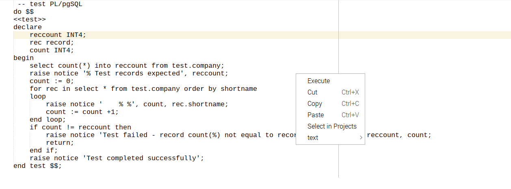
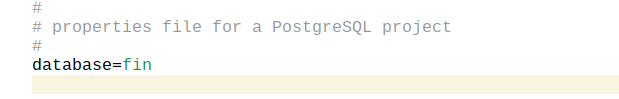
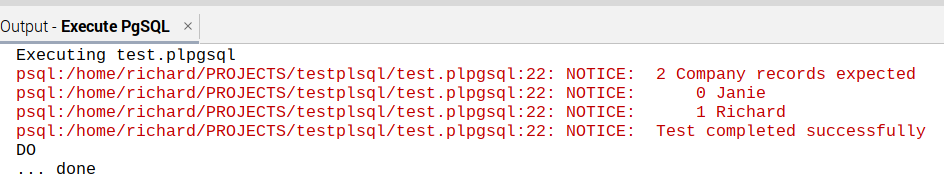

==  PostgreSQL NB-Plugin by Example

=== PostgreSQL file recognition

Any PostgreSQL file (__.pgsql__ or __.plpgsql__) will be recognised by NetBeans
and will have an Execute action included in it's popup menu.

However if the files do not exist within a PostgreSQL project they will not be
actioned.  A database context is needed to execute a command, which is defined
in the __postgresql.properties__ file.

The output and error streams from the execution of the PSQL program, are routed
to the NetBeans Output Window.

=== Save Before Executing Scripts

Save Before Executing, if enabled, saves any PostgreSQL files which have been
modified but not saved, prior to executing the Execute action.

The feature is controlled by a property in the
__postgresql.properties__ file.

[source]
----

    save_before_execution: XXX <1>

----
<1> where XXX is one of NO, YES or ALL. 
This property is optional and its default value is YES.

This property controls how any modified files may be saved prior to running the
execute action.
Only files modified by NetBeans will be considered as a Save candidates.

The possible values for the property are:

* NO - No modified file(s) are saved prior to script execution, so the execute
action will use the version of files as last saved (ignoring the modifications).

* YES - Only the file selected by the execute action (either via the file node
or the editor action), will be saved, if modified, prior to running the
execute action.

* ALL - All modified files that are within the project folder will be saved prior
to running the execute action.
