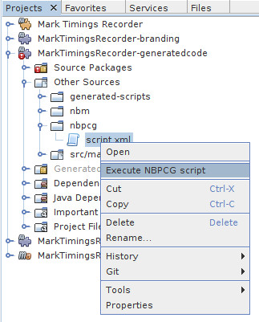
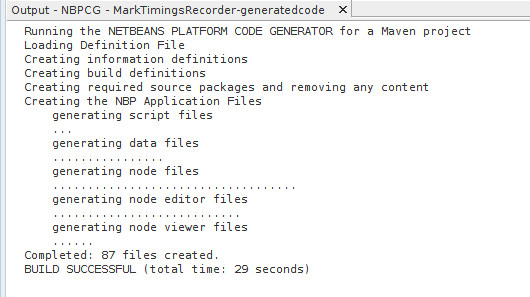

== Creating a project and running the code generator

A normal NetBeans module project should be created (both Maven and ANT build
system projects are supported).  This project is then customised so that the code
generator can be add code to the project.

=== Customising a Maven project

* In Projects View, Add a folder named `nbpcg` under `Other Sources`.
* Place the nbpcg script file ( `script.xml`) in the `nbpcg` node

image::resources/nbpcgfolderandscript.jpg[nbpcg folder and script]

=== Customising an ANT project

* In Files view, Add a folder name `nbpcg-files` under the project root.
* In Project view, Place the nbpcg script file ( `script.xml`) in the `NBPCG File` node.

=== Executing the NBPCG script

The NBPCG script can be executed by actions on the popup menu on:

1)   The Project node

image::resources/projectaction.jpg[project node action]

2)   The NBPCG script file

Executing the script will open a new tab in the output window. Progress and errors will be reported 
in that tab.

=== Dependency Information for NBPCG generated Modules

NBPCG does not currently setup dependencies for the generated modules
(either on NBPCG support libraries or Netbean Platform modules). The
following documentation details the dependencies that exist and should
be added to the various generated modules.

[cols="2,1,1,1,1"]
|===
| |Datamodel |NodeModel |NodeViewer |NodeEditor

|**NetBeans Platform** | | | | 

|Explorer & Property Sheet API | |x |x | 

|Lookup API |x | |x |x 

|Nodes API | |x |x |x 
    
|UI Utilities API | |x |x | 

|Utilities API | |x |x |x 

|Window System API | |x |x | 

|**NBPCG-Library** | | | | 

|MySQL |* | | |  
                                     
|NBPCG Data Support Lib |x |x |x |x 

|NBPCG Form Support Lib | | |x | 

|NBPCG Node Support Lib | |x |x |x 

|NBPCG Support Lib |x |x |x |x 
          
|NBPCG TopComponent Support Lib | |x |x | 

|**GENERATED MODULES** | | | | 

|XX DataModel | |x |x |x 

|XX NodeModel | |x|x| 

|XX NodeEditor | |x| | 

| *If you are using table aliases to access other tables then you will need to add addition dependencies to those modules* | | | | 

|**ALIAS MODULES** | | | | 

|XX DataModel |x |x |x |x 
|===
