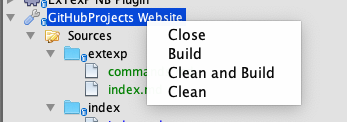
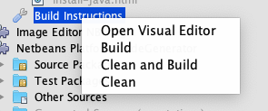

title=Extexp User Documentation - An Extexp Project
date=2022-05-21
type=document
status=published
nextpage=commands
previouspage=installing
sectionlistname=extexp_ug
~~~~~~

## An Extexp Project ##

### Creating an Extexp project ###

Any Extexp project has the following minimum content within the project directory:

*   The Source folder: A folder (src) is used for all input content resources etc.
If required, all sources can be stored in this single folder or it can be subdivided
into a deeper folder structure.

*   The Build file: this file (build.json) defines the MAIN command sequence and any other
command sequences. It defines the build execution for this project.

When processing the build file, an output directory will be created in the project directory
into which all output will collect.  A cache directory at the same level may be created
to hold any necessary intermediate values created during the build process.

### Creating the Extexp Build file ##

The build file is a Json formatted file which contains one or more 
command sequences. There must be one sequence named MAIN which is the top-level sequence,
other named sequences can be defined which can be called as required.

More details and examples the build file content can be found [here](commands.html).

### Executing the Build file ###

The pop-up menu at the project level and at the build file level have commands
to execute the build file.

&nbsp;&nbsp;

Both have the following commands:

*  Clean: delete all content in the output and cache directories of the project

*  Build: execute the build file

*  Clean and Build: a clean action followed by build action

The build file also had one additional feature which is "Open Visual Editor"
which is an experimental feature which displays the command sequences in a
visual format. Thus providing visual feedback of the build file structure.
