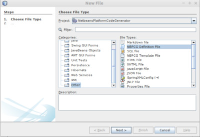

= NBPCG User Guide - Script Content/Syntax Notes
Richard Linsdale
2022-05-21
:jbake-type: document
:jbake-status: published
:jbake-nextpage: install
:jbake-previouspage: project
:jbake-sectionlistname: nbpcg_ug

== Script Content/Syntax Notes

The NBPCG script is an XML document.  A template is available - using the New... entry, the template can be selected 
from the other category with file type NBPCG Definition file

The structure of the script XML file is described below:

The top level element is the <nbpcg> element.

=== The <nbpcg> element 

*Attributes*

* name: The name of the script (required)

*Child Elements*

* build: (one or more)
* node: (one or more)
* databases: (one or more) 

=== The <build> element 

Defines the build information - artifact selection, projects and packages etc.

*Attributes*

* viewerrole: the viewerroles for this application - comma separated list (required)
* copyright: the copyright key information -  year(s) and name / email, this will be added to every licence header placed in a generated file (required)

*Child Elements*

* project: (one or more)

=== The <project> element

Defines the project information.

*Attributes*

* name: the project name (required)
* license: the license header to be added to generated files - one of apache20, gpl30 or lgpl21 (optional, default apache20)

*Child Elements*

*   generate: (one or more)

=== The <generate> element

Requests the generation of code or resource files for various types of entities.

*Attributes*

* type: the type of code artifact to be generated - one of data, dataaccess, node, nodeviewer, editor, script (required)
* package: the package name to be used for all artifacts generated by this request (required)
* exclude: a list of nodes or entities to be excluded from this generate command, the list is comma separated and must not include any spaces around the comma (optional)

=== The <node> element

Defines the nodes required and their interrelationships.

*Attributes*

* name: the node name (required)
* view: the types of view required - one of both, icon, tree, none (optional, default tree)
* viewers: (optional)
* dbname: the database name  (optional)
* rootlabel:  (optional)
* rooticon: the root node icon name (optional)
* icon: the node icon name (optional)
* label:  (optional)
* orderable: set to yes if nodes are allowed to be orderable (by drag and drop) - default is no (optional)
* nullallowed: set to yes if null value is allowed (optional)
* fkey: set to no if foreign key is not utilised - default is yes (optional)
* nomodifiers: set to yes if nodeviewers are to be created without the default copy/cut/paste/delete functionality (optional)
* customchildfactorypackage: set if user provides the child factory implementation for this node.  The value is the package in which the custom code exists (optional)
* childnodesineditor: a comma separated list of child nodes which are to be displayed in this node's editor as editable tables (optional)
* dynamicicon: the method use to obtain the icon for this node, if dynamic icon selection is required (optional)
* displaynameformat: format for the node's display name (optional)
* displaytitleformat: format for the node's display title (optional)
* sortformat: format for the node's sort string - also implies sortable (optional)
* childnodesineditor: the list of child nodes in this editor (optional)
* min: minimum number of this node type (as a childnode)  (optional)
* max: maximum number of this node type (as a childnode) (optional)

*Child Elements*

* entryfields: entry fields (zero or more)
* action: (zero or more)
* node: child nodes of this node (zero or more)

=== The <entryfield> element

Defines an entry fields and its configuration and mapping to an entity field.

*Attributes*

* name: the name of the field (required)
* label:  (optional)
* type: the entry field type (must be password) (required)
* mapsto: the entity field to which this field is mapped (required)
* mapping: the method used to converted the entry field value to the entity field value (required)
* rule: the method to be applied to this entry field to test it correctness (optional)
* errormessage: The error message to be generated if the rule fails  (optional)

=== The <action> element

*Attributes*

* name (required)
* label (required)

=== The <databases> element 

Collection of all database definitions.

*Child Elements*

* database: (zero or more)

== The <database> element

Definition of a database object.

*Attributes*

* name: the logical name of this database (required)
* dbname: the database name of this database - default is attribute name (optional)
* pkey: database key type - one of idauto (optional)
* extrafields: additional standard fields to add - one of usertimestamp (optional)
* usepackage: ?? (optional)

*Child Elements*

* table: (zero or more)

=== The <table> element

Definition of a database table object.

*Attributes*

* name: entity name (required)
* dbname: the database name of this table - default is attribute name  (optional)
* pkey: database key type - one of idauto (optional)
* extrafields: additional standard fields to add - one of usertimestamp (optional)
* rule: the table level rule to be applied (optional)

*Child Elements*

* field: (zero or more)
* insertentity: (zero or more)

=== The <field> element

Definition of a database table field (column) object.

*Attributes*

* pkey: yes if this field is the primary key  (optional)
* name: field name (required)
* dbname: the table column name - defaults to attribute name (optional)
* index: define the indexing for this field - one of unique or yes - default is no (optional)
* unique: define the uniqueness of this field - one of yes - default is no (optional)
* type: data type of the field one of boolean, long, int, date, datetime, enum, password or reference - default is string (optional)
* decimalsize: the size of the  decimal number (optional)
* choicemethod: the method to be used to obtain set of possible choices for this field (optional)
* nullallowed: are null values allowed? - one of yes - default is no (optional)
* label: the field label (optional)
* references: the target entity for this reference (optional)
* fkey:  set to no if foreign key is not utilised - default is yes  (optional)
* values: set of enum values (comma separated) (optional)
* min: min length of string entered, min value of number entered (optional)
* max: max length of string entered, max value of number entered (optional)
* future: set to yes if date or datetime entered must be in future (optional)
* past: set to yes if date or datetime entered must be in past (optional)
* tablecolumnname (optional)

=== The <insertentity> element

Definition of an data row to be inserted into the database table object.

*Child Elements*

* insertfield: (zero or more)
