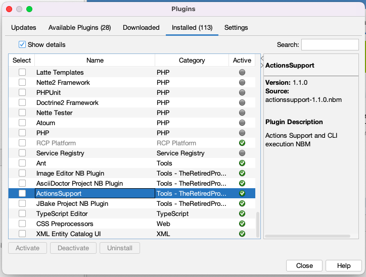
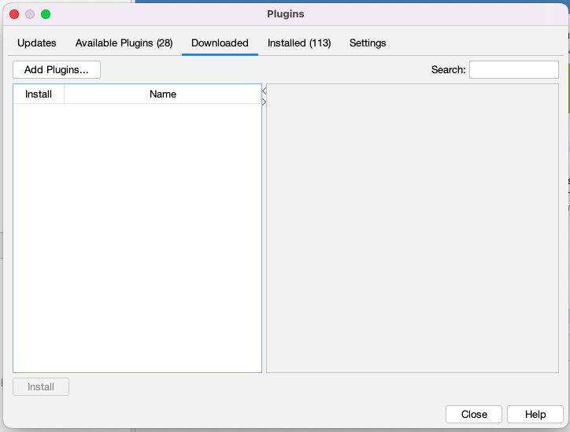
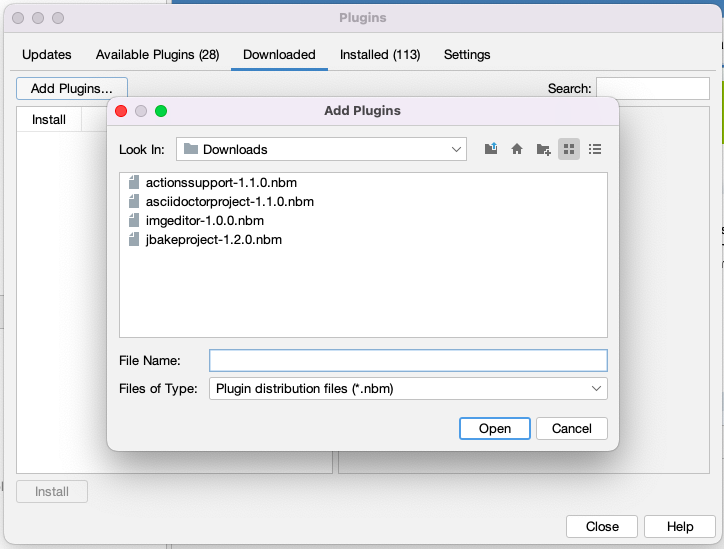

= NetBeans Notes - Installing a NetBeans Module
Richard Linsdale
2022-07-10
:jbake-type: page
:jbake-status: published
:jbake-tags: General

Some of The-Retired-Programmer projects develop NetBeans
Plug-ins (NetBeans Modules or NBMs).

This document covers installing these into a Netbeans installation.

Projects uses the GitHub Releases to record the formal releases.  In addition
the NBM file created as part of the release in stored within the release information.

For a fuller description of The-Retired_Programmer use of GitHub as repository,
please look at: https://www.the-retired-programmer.uk/githubdevelopmentnotes.html

=== Step to install a NBM.

WARNING: Ensure any dependencies on other NBM are satisfied, by loading these
NBMs prior to your project NBM,

Download the latest version of the required NBM to your local machine.

Click on the NetBeans Tools>Plugins menu item to display the Plugin dialog
screen.

image::resources/plugin-window-initial.png[initial window opened]

You can view the modules already installed by clicking on the "Installed" tab
and then selecting "Show details"

In this tab it is possible to select a NBM and then its details will be shown in
the right hand pane.

It is also possible to "Deactivate" or "Uninstall" a NBM module by using the
buttons at the bottom of a tab.

To install a Module you select the "Downloaded"tab.

Then click the "Add Plugins..." button to display a file selection dialogue.
navigate to the correct folder (if required) and then select the NBM file that
you want to install.

Then follow the process to install the NBM(s).
Note that at present The-Retired-Programmer is not signing NBMs, so you will
see a warning message to which you should reply "Continue" to complete the
Installation.
