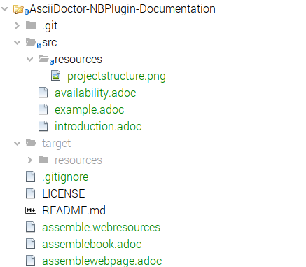
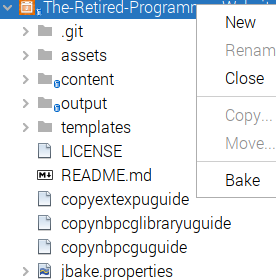

==  Examples of the AsciiDoctor NB-Plugin

=== The project structure

The project structure is:

* up to 3 assembly definition files located at the root level of the project. 
* a set of asciidoc files, located within the src folder
* resources (images etc) to be used in the build, in one or more resource folder
with the src folder
* a target folder into which the generated files are saved (pdf and/or html),
and resources folder within the target folder to collect all resources needed
for the generated html document 

=== The project actions

The project includes actions to execute asciidoctor commands to build the
book (pdf) or webpage (html).

The output of the command is routed to the NetBeans output window, while the
generated document is created in the target folder. 

=== The "Build book" action and its associated assembly definition documents

There is a single assembly definition for building a book.  This is
__assemblebook.adoc_.
Typically this is a series of asciidoc include statements, but can
include any other necessary statements to ensure the completion of the build.

[source]
----

= AsciiDoctor Project Plugin User Guide : Early Preview Edition <1>

:imagesdir: src/ <2> 
<3>
\include::src/introduction.adoc[]

\include::src/example.adoc[]

\include::src/availability.adoc[]

----
<1> book title
<2> a necessary statement to ensure access to images for embedding
<3> include statement(s)

===  The "Build webpage" action and its associated assembly definition documents

There are two assembly definitions for building a webpage.  These are
__assemblewebpage.adoc_ and assemble.webresources.

assemblewebpage.adoc is very similar to the equivalent assemblebook.adoc,
however they are not exact copies as some instructions are only required in
one of the environments.  So in this example the assemblewebpage.adoc is

[source]
----
= AsciiDoctor Project Plugin User Guide : Early Preview Edition

\include::src/introduction.adoc[]

\include::src/example.adoc[]

\include::src/availability.adoc[]
----

The assemble.webresources is a command file which copies all required resources
to the target/resources file.  In this case it is as simple as:

[source]
----
cp src/resources/* target/resources/
----

